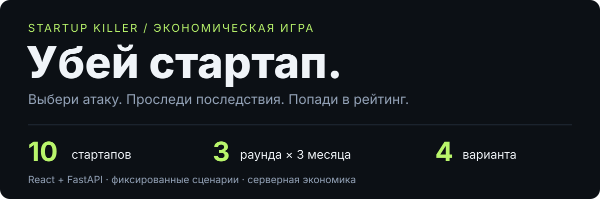

<p align="center">
  
</p>

<p align="center">
  <a href="LICENSE"></a>
  
  
  
</p>

**«Убей стартап»** — браузерная игра, в которой ты испытываешь бизнес на прочность. Получи случайный стартап, выбери способы навредить ему и наблюдай, как решения отражаются на выручке, расходах и остатке денег. Завершённые партии попадают в общий рейтинг.

<p align="center">
  
  
  
</p>

*Три из десяти игровых стартапов. Это иллюстрации из проекта, а не скриншоты интерфейса.*

## Как играть

1. Введи никнейм и получи один случайный стартап из десяти.
2. Выбери одну из четырёх подготовленных карточек атаки.
3. Посмотри экономические последствия за три виртуальных месяца.
4. Пройди три раунда или доведи компанию до банкротства раньше. Сравни итог с рейтингом.

В каталоге **120 карточек**: 10 компаний × 3 раунда × 4 варианта. Тексты и параметры подготовлены заранее; во время партии контент не генерируется. Каждая сессия сохраняет собственный снимок 12 карточек.

## Быстрый старт

Для нового локального экземпляра нужны **Docker и Docker Compose**.

```sh
git clone https://github.com/1202-modules/startup-killer.git
cd startup-killer
cp .env.example .env
```

В `.env` замени `POSTGRES_PASSWORD` и `SECRET_KEY` на свои случайные значения (для ключа — минимум 32 байта). Их можно получить командой `openssl rand -hex 32`. Установи `PORT=8080`, затем:

```sh
docker compose up --build -d
```

Открой **[localhost:8080](http://localhost:8080)**. Compose запускает PostgreSQL, API и SPA через Nginx; API автоматически применяет миграции.

```sh
docker compose logs -f api   # логи API
docker compose down          # остановка; данные остаются в volume
```

**Для существующей БД:** миграция `0002_deterministic_attack_choices` удаляет прежние AI/admin-таблицы, секреты и исходные тексты атак. Рассчитанные проводки и результаты сохраняются. Downgrade не поддерживается — перед обновлением нужен проверенный backup. См. [runbook](implementation/RELEASE_RUNBOOK.md).

## Разработка

Python 3.12 и Node.js 20. Backend и frontend запускаются в двух терминалах из корня проекта.

```sh
python3 -m venv .venv
source .venv/bin/activate
pip install -r backend/requirements.txt

# Отдельная локальная БД; не используй production-данные.
export DATABASE_URL='sqlite+aiosqlite:///./dev.sqlite3'
export SYNC_DATABASE_URL='sqlite:///./dev.sqlite3'
alembic -c backend/alembic.ini upgrade head
python3 -m uvicorn backend.app.main:app --host 127.0.0.1 --port 8000
```

```sh
cd apps/web
npm ci
npm run dev -- --host 127.0.0.1
```

Игра: [localhost:5173](http://localhost:5173). Swagger API: [localhost:8000/docs](http://localhost:8000/docs).

## Под капотом

```text
React SPA → FastAPI → SQLAlchemy → PostgreSQL
                ↓
     каталог → снимок сессии → экономический движок → рейтинг
```

Клиент отправляет только `choice_id`. Сервер проверяет выбор по снимку сессии и рассчитывает последствия. Деньги хранятся в копейках; очки считаются только на сервере. Скрытые слабости и коэффициенты в браузер не передаются.

| Часть | Стек |
| --- | --- |
| Интерфейс | React, TypeScript, Vite, Tailwind, Framer Motion |
| Данные клиента | TanStack Query; Zustand для локального UI |
| API и хранение | FastAPI, SQLAlchemy 2, Alembic, PostgreSQL |
| Развёртывание | Статическая SPA через Nginx, один API-процесс |

## Проверки

Из корня проекта, с активным Python-окружением:

```sh
python3 tools/spec_check.py
python3 tools/contract_lint.py
python3 tools/verify_assets.py
python3 -m pytest backend/tests -q
```

Из `apps/web`:

```sh
npm test -- --run
npm run build
```

Числовые расчёты проверяются по **30 эталонным сценариям**. [Матрица соответствия](implementation/CONFORMANCE_MATRIX.md) отделяет локальные проверки от production-приёмки: benchmark на целевом хосте **2 vCPU / 2 GiB** и production-миграция ещё не пройдены.

## Документация и вклад

- [Правила игры](docs/GAME_RULES.md) · [Экономика](docs/ECONOMY.md) · [Очки](docs/SCORING.md)
- [API](docs/API.md) · [Архитектура](docs/ARCHITECTURE.md) · [Ассеты](docs/ASSETS.md)
- [Дорожная карта](implementation/ROADMAP.md) · [Задачи](implementation/TASKS.md) · [Отчёт по балансу](BALANCE_REPORT.md)

Предложения и ошибки можно отправлять через Issues и Pull Requests. Перед изменениями прочитай [AGENTS.md](AGENTS.md) и [порядок работы](ANTIGRAVITY_START_HERE.md), запусти проверки контрактов. Изменения экономики, сценариев и визуального контракта требуют согласования с владельцем.

## Лицензия

[MIT](LICENSE). Зависимости распространяются под собственными лицензиями.
